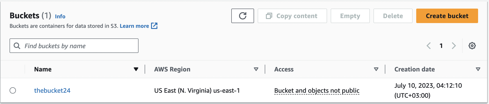
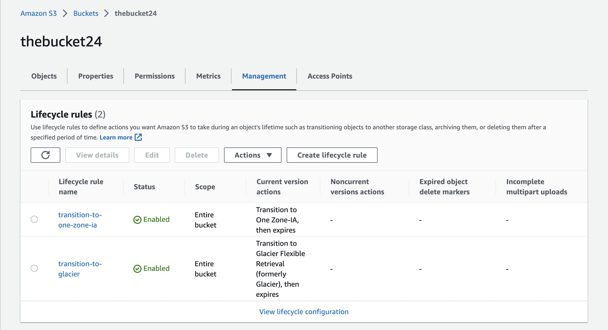
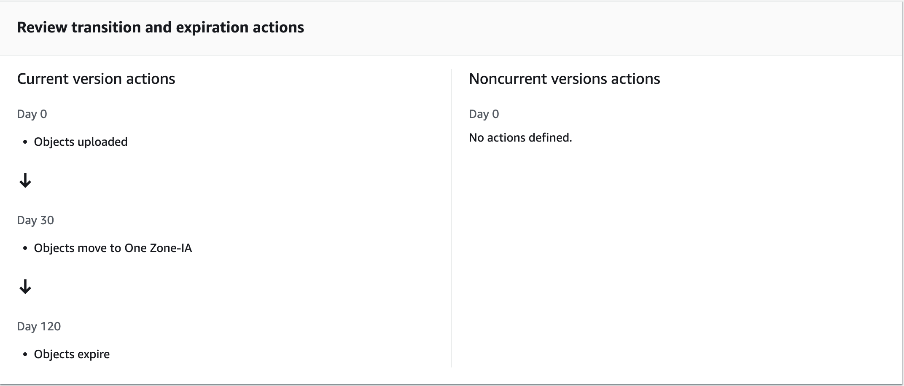
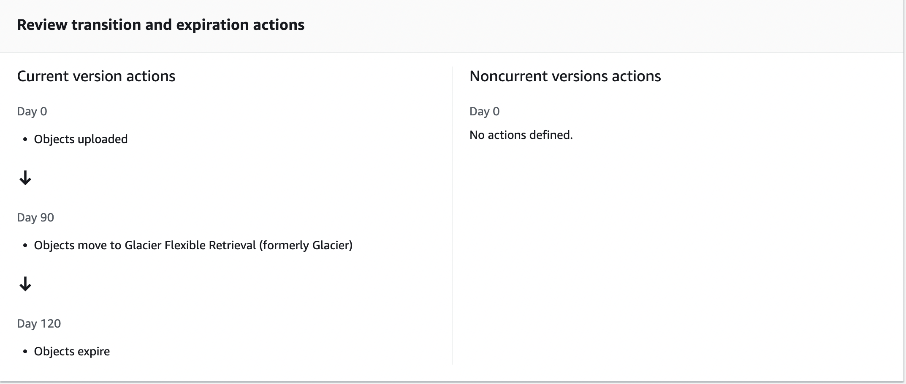

#  S3 Bucket lifecycle policy using Terraform

You can test this project with this commands on your machine.

- First, Initialize Terraform by running the below command:
```bash
  terraform init
```
- To generate the action plans run the below command:
```bash
  terraform plan
```
- To create all the resources declared in main.tf configuration file, run the below command:
```bash
  terraform apply
```
- To create all the resources declared in main.tf configuration file, run the below command:
```bash
  terraform destroy
```

<hr>
<br>

## Project Outputs










